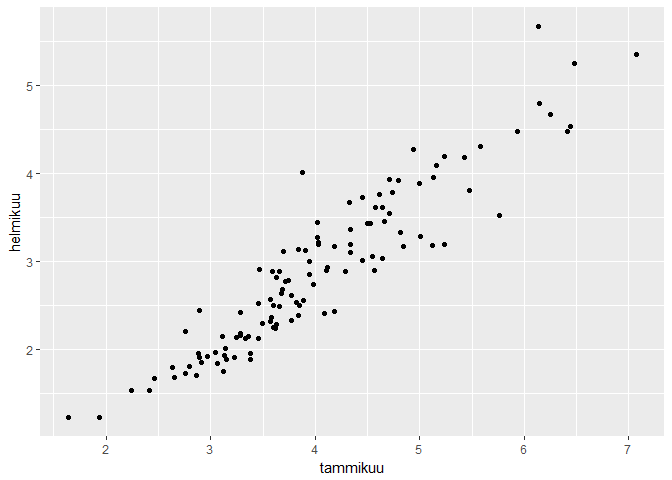
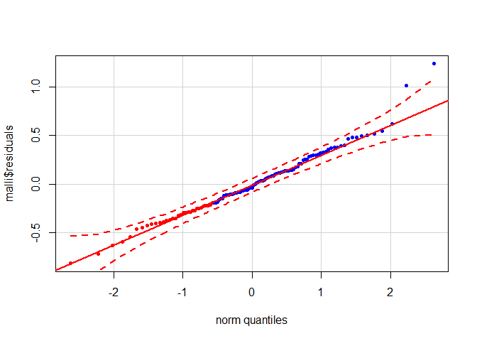
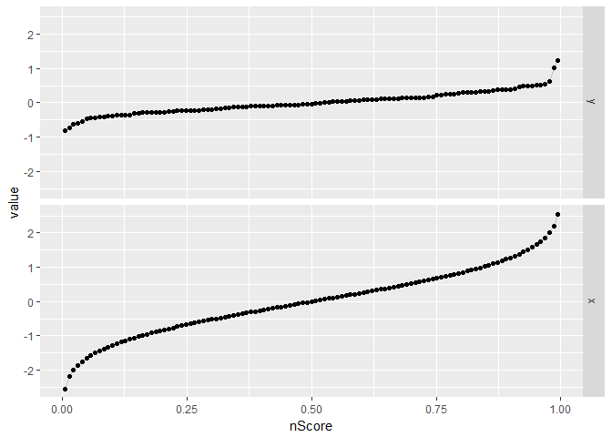

Ladataan käytettävät paketit:

``` r
library(magrittr)
```

    ## Warning: package 'magrittr' was built under R version 3.4.4

``` r
library(ggplot2)
library(car)
```

    ## Warning: package 'car' was built under R version 3.4.4

``` r
library(MASS)
library(dplyr)
library(reshape)
```

    ## Warning: package 'reshape' was built under R version 3.4.4

Käytettävä aineisto on peräisin kirjasta: Manual Solution Probability and Statistic, Anthony Hayter 4th Edition.

Aineistossa on mitattu Niilin virtauksia Wadi Halfassa tammi-helmikuussa vuosien 1874 ja 1988 välisenä aikanan. Tarkoituksena on luoda malli, jonka avulla tammikuun virtauksen perusteella voidaan ennustaa helmikuun virtaus.

Alustetaan aineisto ja tulostetaan sen kuvaaja:

``` r
tammikuu = c(6.41,4.18,5.43,3.38,5.47,5.24,4.57,3.46,7.07,6.48,4.45,4.55,4.66,5.16,4.81,3.77,4.64,5.12,2.86,4.09,5.24,4.84,6.14,5.01,6.25,5.93,6.44,4.34,5.58,1.94,3.84,3.38,3.62,4.5,3.85,3.69,4.29,3.6,4.53,5,4.34,2.76,2.89,1.64,3.98,3.49,4.74,4.8,3.28,2.88,3.28,2.91,3.14,3.57,3.25,2.97,3.6,2.41,3.28,3.66,2.46,3.05,3.84,3.89,3.77,3.46,3.11,3.36,4.02,3.13,2.24,3.33,3.15,2.8,2.65,3.82,4.33,3.71,3.66,3.94,3.63,3.23,2.76,3.12,4.11,3.59,4.02,2.63,3.58,3.68,3.06,4.34,4.03,5.13,6.13,4.58,4.61,4.94,3.91,4.03,4.64,4.45,2.89,3.57,4.18,4.71,4.12,5.76,4.71,3.63,3.74,3.94,3.47,3.88,3.7)
helmikuu = c(4.48,2.43,4.18,1.89,3.81,4.19,2.9,2.13,5.36,5.25,3.01,3.06,3.46,4.09,3.33,2.33,3.04,3.18,1.7,2.41,3.19,3.17,4.8,3.29,4.67,4.48,4.54,3.1,4.31,1.23,2.39,1.96,2.24,3.43,2.5,2.68,2.89,2.25,3.43,3.89,3.2,2.21,1.91,1.23,2.74,2.3,3.79,3.92,2.42,1.95,2.16,1.85,2.01,2.32,2.14,1.92,2.5,1.54,2.18,2.49,1.67,1.97,3.14,2.56,2.62,2.52,2.15,2.15,3.28,1.93,1.53,2.13,1.89,1.81,1.68,2.53,3.67,2.77,2.89,3,2.28,1.91,1.73,1.75,2.9,2.89,3.44,1.8,2.36,2.64,1.84,3.37,3.22,3.96,5.67,3.61,3.76,4.28,3.13,3.19,3.62,3.73,2.45,2.57,3.17,3.93,2.93,3.53,3.55,2.82,2.78,2.85,2.91,4.01,3.12)

virtaus = data.frame(tammikuu, helmikuu)

gg <- ggplot(virtaus, aes(x = tammikuu, y = helmikuu)) + 
  geom_point() 

plot(gg)
```



Kuvaajan perusteella tammi- ja helmikuun välillä näyttäisi vallitsevan lineaarinen yhteys. Joten luodaan lineaarinen malli:

``` r
kaava = helmikuu ~ tammikuu

malli = lm(kaava, data = virtaus)
```

Olennainen osa mallin sovittamista on sen luotetavuuden arviointi.

Eräs tarkasteltava seikka ovat residuaalit.

Ne eivät saa sisältää säännönmukaisuuksia, vaan niiden pitää olla satunnaisia.

Yksi tapa on residuaalien visuaaliseen tarkasteluun on kvantiilikvantiili-kuvio, jossa havaitttuja residuaaleja verrataan normaalijakaumaan.

Mikäli residuaalit ovat satunnaisia, astettuvat ne kuvion läviställe.

Perus kvantiilikvantiili kuvion saa tulostettua R:n qqplot käskyllä, mutta car-paketin qqPlot -käsky tulostaa informatiivisemman kuvaajan.

Tulostetaan alustetun mallin residuaaleista kvantiilikvantiili kuvio car paketin qqPlot käskyä käyttäen:

``` r
qqPlot(malli$residuals,
       pch = 20, 
       col = c(rep("red", 33), rep("blue", 99)),
       envelope=.95
)
```



Kuviosta näkyy, että residuaalit istuvat koko lailla hyvin normaalijakautuneisuutta edustavalle lävistäjälle.

Pari aineiston ulkopuolista havaintoakin näyttää olevan.

Mutta ei niistä sen enempää.

Tämän oppaan tarkoitus on nimittäin selvittää, kuinka katkoviivoilla kuvatut luottamusvälit saadaan manuaalisesti laskettua.

En löytänyt R:stä suoraa tapaa qqplotin luottamusvälien laskemiseen, mikä ei tarkoita sitä, etteikö sellaista kenties ole. Mutta ainakaan minä en sitä löytänyt. Sen sijaan stackexchange -sivulta <a href="https://stats.stackexchange.com/questions/111288/confidence-bands-for-qq-line">ohje</a> lopulta löytyi.

Kvantiilikvantiili kuviossa havaitut arvot tulosteaan suhteessa niitä vastaavien normaalijakauman arvojen kanssa.

Järjestetään residuaalit pienimmästä suurimpaan ja lasketaan kutakin jäännöstä vastaava kertymäfunktion arvo.

``` r
df = data.frame(y = unname(malli$residuals)) # Y-Akselille tulevat empiiriset kvantiilit

df %<>%
  arrange(y) %>%
  mutate(i = 1:n(),
         nScore = (i - 3/8)/(nrow(df) + 0.25)) %>%
  select(y, nScore)
```

Kertymäfunktion arvon laskemiseen käytettävä kaava löytyy kirjasta: Manual Solution Probability and Statistic.

Tämän jälkeen voidaan laskea havaintojen kertymäfunktion arvoja vastaavat normaalijakauman arvot:

``` r
df$x <- qnorm(df$nScore, mean=0, sd = 1) 
```

Kvantiilikvantiili kuvion ideana on yhdistää kahden erillisen kertymäfunktion kuvaajat yhdistämällä ne yhteisten kertymäfunktion kohtien avulla.

Tulostetaan havaittujen ja niitä vastaavien odotettujen arvojen kuvaajat erikseen:

``` r
mdata <- melt(df, id=c("nScore"))

ggplot(mdata, aes(x=nScore, y = value)) + 
  geom_line(col="grey") +
  geom_point() + 
  facet_grid(variable ~ .) 
```



Ajatus on, että Q-Q plotin lävistäjän viiva vastaa lineaarisen mallin regressiosuoraa.

Tällä kertaa selittävinä arvoina käytetään normaalijakauman arvoja ja selitettävinä arvoina havaittuja arvoja.

Laaditaan empiiriset havainnot ja normaalijakauman yhdistävä lineaarinen malli. Apuna käytetään MASS -paketin rlm -funktiota.

Yksinkertaistetusti sanottuna rlm on kehittyneempi versio perus lineaarisesta mallista. Se ei ole yhtä herkkä poikkeaville havainnoille, kuin lineaarisen mallin perusversio.

``` r
coef <- coef(rlm(y~x, data = df))
a <- coef[1]
b <- coef[2]
```

Lasketaan havaintojen vaihteluväli 95 %:n luottamustasolla.

``` r
luottamustaso = 0.95
p = (1 -(1 - luottamustaso)/2)
zz <- qnorm(p)  # - Luottamustasoon liittyvä kriittinen arvo
```

Ja homman ydin on seuraava kohta, eli keskivirheen laskemisen kaava.

``` r
SE <- (b/dnorm(df$x)) * sqrt(df$nScore * (1- df$nScore) / nrow(df))
```

Nyt voidaan laskea lävistäjä ja ylempi- sekä alempi luottamusraja:

``` r
df$fit <- a + b * df$x
df$fitUpper = df$fit + zz * SE
df$fitLower = df$fit - zz * SE
```

Tulostetaan laskettujen tietojen avulla qqPlot:

``` r
gg <- ggplot(df, aes(x=x, y=y)) + 
  geom_point() +
  geom_line(aes(x = x, y = fit), color="blue") +
  geom_line(aes(x = x, y = fitLower), color="blue", linetype="dashed",size=1) +
  geom_line(aes(x = x, y = fitUpper), color="blue", linetype="dashed",size=1)

plot(gg)
```


